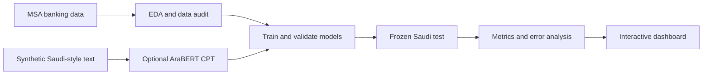
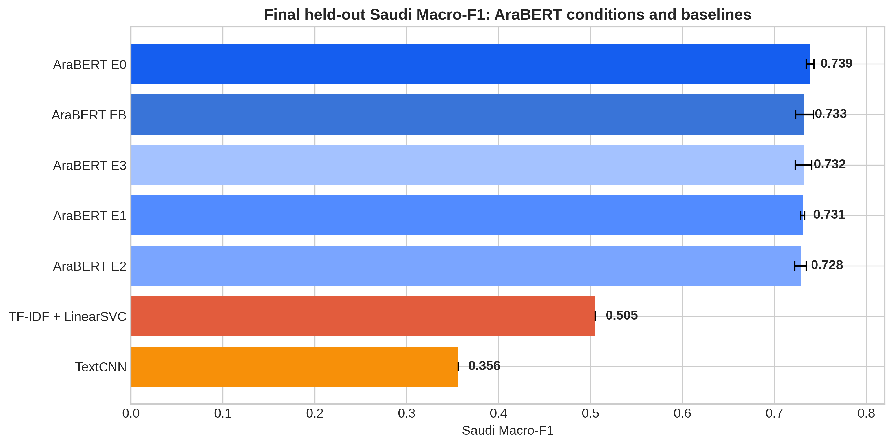
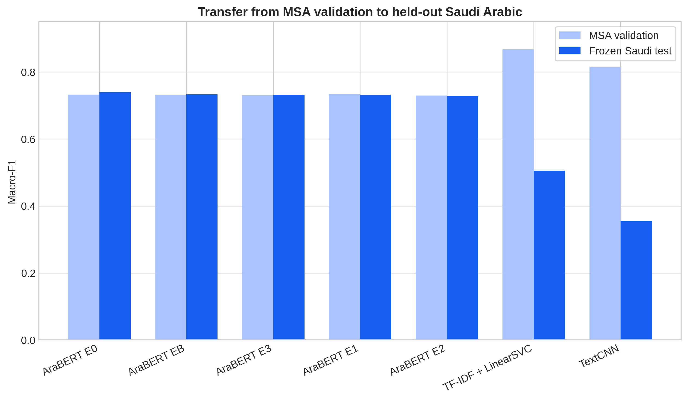
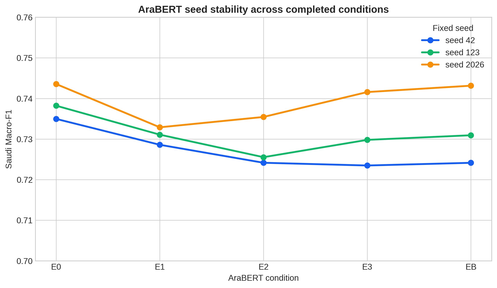
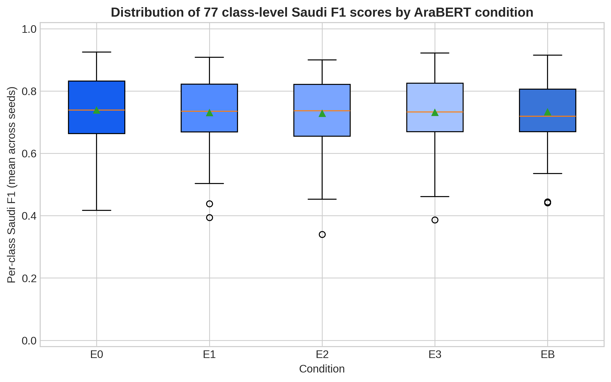
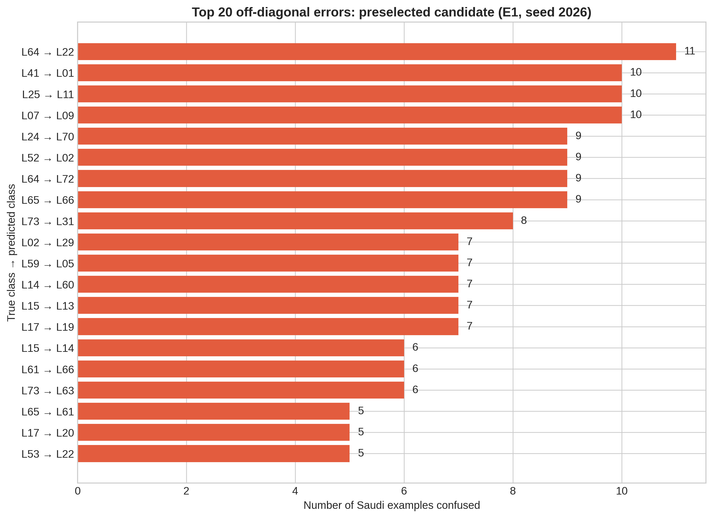

# SARF | صرف — Arabic Banking Intent Classifier

> A research prototype for classifying Arabic banking intents across Modern Standard Arabic (MSA) and Saudi Arabic.

[**Try the live dashboard**](https://sarf-banking-nlp.streamlit.app)

SARF studies whether a model trained on MSA banking queries can understand Saudi-style banking requests. It compares classical and neural baselines with AraBERT, evaluates cross-dialect transfer on a frozen Saudi test set, and presents the findings through an interactive dashboard.

---

## 1. The problem

Arabic banking users may write in formal MSA, a regional dialect, or a mixture of both. A model can perform well on language that resembles its training data and still lose performance when the same intent is expressed differently.

SARF focuses on this transfer problem. The project asks:

> **Can AraBERT fine-tuned on MSA banking intents generalize to Saudi Arabic, and does additional synthetic Saudi-style pre-training improve that transfer?**

SARF is an inference-only research prototype. It predicts an intent, but it does not access accounts, process payments, or make financial decisions.

## 2. Data

The supervised task uses 77 banking intents from the approved ArBanking77-based project splits [1]. Each split has a fixed role:

| Split | Examples | Purpose |
|---|---:|---|
| MSA train | 10,732 | Model training |
| MSA validation | 1,229 | Checkpoint and training decisions |
| MSA test | 3,574 | Additional MSA reference evaluation |
| Saudi frozen test | 3,580 | Final cross-dialect evaluation |

The MSA training data are imbalanced, with 31 to 291 examples per intent. Therefore, **Macro-F1** is the primary metric because it gives every intent equal weight. Weighted-F1 and accuracy are reported as supporting metrics.

## 3. Methodology

The project follows this sequence:



The important separation is that model development uses the MSA splits, while the Saudi split is reserved for the final transfer evaluation.

### Synthetic Saudi-style data

The project generated two unlabelled text pools:

- a general Saudi-style corpus covering everyday topics outside banking;
- a smaller Saudi banking-domain corpus covering topics such as cards, transfers, account access, payments, and ATMs.

The prompts encouraged varied Saudi-style questions, statements, and comments. They also prohibited private information, direct copying of known examples, and unnecessary banking content in the general corpus.

The generated data were checked for clarity, genre, length, privacy, duplication, and overlap with the frozen Saudi test. These checks make the corpus auditable, but synthetic text is not equivalent to human-authored Saudi data.

### Models

**TF-IDF + LinearSVC** is the classical baseline. It represents word and character patterns and classifies them with a linear support-vector machine.

**TextCNN** is a neural baseline that learns local word-pattern features with convolutional filters. It does not use a pretrained Arabic language model.

**AraBERTv2-base** is the main transformer model [2] [3]. It is fine-tuned on the labelled MSA banking data. Some conditions receive one stage of Continued Pre-Training (CPT) on unlabelled synthetic Saudi-style text before fine-tuning.

| Condition | CPT exposure |
|---|---|
| **E0** | No Saudi CPT |
| **E1** | 3K general Saudi-style texts |
| **E2** | 6K general Saudi-style texts |
| **E3** | 12K general Saudi-style texts |
| **EB** | 12K general texts plus 3K Saudi banking texts |

CPT provides language exposure; it does not directly provide intent labels. Every AraBERT condition was run with the same seeds: **42, 123, and 2026**.

## 4. Results

The final comparison used the frozen Saudi test set. AraBERT results are reported as the mean and standard deviation across three seeds. The baselines use their final frozen pipelines.

| Model | Saudi Macro-F1 | Saudi Weighted-F1 | Saudi Accuracy |
|---|---:|---:|---:|
| **AraBERT E0** | **0.739 ± 0.004** | 0.739 ± 0.005 | 0.740 ± 0.004 |
| AraBERT EB | 0.733 ± 0.010 | 0.733 ± 0.010 | 0.735 ± 0.009 |
| AraBERT E3 | 0.732 ± 0.010 | 0.731 ± 0.009 | 0.733 ± 0.009 |
| AraBERT E1 | 0.731 ± 0.002 | 0.731 ± 0.002 | 0.733 ± 0.002 |
| AraBERT E2 | 0.728 ± 0.006 | 0.728 ± 0.007 | 0.730 ± 0.006 |
| TF-IDF + LinearSVC | 0.505 | 0.509 | 0.520 |
| TextCNN | 0.356 | 0.359 | 0.350 |



**Finding:** AraBERT transferred better to Saudi Arabic than both baselines. E0 produced the highest mean AraBERT score. The CPT conditions were close, but additional synthetic CPT did not automatically improve the final Saudi result.



This comparison shows the cross-dialect challenge. The baselines performed much better on MSA validation than on Saudi Arabic. Their Saudi Macro-F1 scores fell to 0.505 for TF-IDF + LinearSVC and 0.356 for TextCNN. AraBERT also faced a drop, but transferred more successfully.



The seed chart shows how consistent the AraBERT results are across the three fixed seeds. Reporting seed variation prevents the conclusion from depending on one random initialization.



The per-intent distribution shows that the overall score is an average across 77 different outcomes. Some intents are handled more reliably than others, which is why the project also examines class-level metrics.



The confusion chart shows the most frequent intent pairs that the model mixes up. These errors often involve closely related banking situations or similar wording. They point to areas where clearer labels and more representative examples could help.

### Dashboard checkpoint

The live dashboard uses the fixed **E1 / seed 2026** checkpoint as its representative interactive model. Its KPI reports the E1 mean Saudi Macro-F1 of approximately **0.731 across three seeds**.

This does not change the final comparison: **E0 is the best aggregate AraBERT condition**, while E1 / 2026 is the checkpoint selected for the interactive demonstration.

## 5. Limitations

- The 77-intent taxonomy contains closely related categories. Short requests can be genuinely ambiguous between two labels.
- The MSA training data are imbalanced, so performance is not equally supported for every intent.
- Synthetic CPT provides language exposure but does not provide human-labelled Saudi intent boundaries.
- The model is not calibrated. A high softmax score is not a guarantee of correctness.
- Every input is assigned to one of the known intents. There is no dedicated out-of-scope detector.
- The live prediction uses one fixed checkpoint rather than an ensemble.
- Retrieval examples are diagnostic only and do not change AraBERT’s prediction.
- The prototype should not be used with real personal, account, card, or transaction information.

## 6. Future work

The most valuable next step is to improve the data and intent boundaries rather than simply generating more text. Possible directions include:

1. collect and annotate more human-authored Saudi banking queries;
2. review closely related intent categories and add examples for difficult classes;
3. test supervised Saudi adaptation and parameter-efficient methods such as LoRA;
4. evaluate calibration and an explicit unknown-intent option;
5. use hard-negative or contrastive training for similar intents; and
6. compare ensembles across seeds or model families.

Future experiments should use a new development protocol or a newly frozen test set. The current Saudi test should remain reserved for final evaluation.

## 7. Dashboard overview

The [live dashboard](https://sarf-banking-nlp.streamlit.app) provides two views.

### Try the Model

The user enters a banking sentence and receives:

- the predicted intent and request latency;
- the top alternatives and their scores;
- the gap between the first and second predictions;
- the closest MSA training examples, retrieved with multilingual sentence embeddings and cosine similarity;
- historical confusion partners from the Saudi evaluation; and
- optional per-intent F1, precision, recall, support, and seed stability.

The retrieval section is explanatory only. It does not act as a second classifier and does not modify the AraBERT prediction.

### Understand the Results

This page presents the project findings through pre-computed evaluation assets. It includes model comparison, per-intent F1 distribution, confusion pairs, training-intent distribution, and text-length summaries. It does not retrain a model or recalculate the final evaluation live.

The interface supports English and Arabic, including right-to-left layout for the Arabic view.

## 8. Running the application

Large model files are not stored in GitHub. The application downloads the required model and retrieval artifacts from the configured Hugging Face repositories on first use. Credentials and repository identifiers are supplied through Streamlit secrets rather than hard-coded in the source.

### Local Docker run

```bash
docker compose build
docker compose up
```

### Streamlit Community Cloud

The public deployment uses `app/streamlit_app.py` as its entry point. Dependencies are pinned in `app/requirements.txt`, and system packages are listed in `packages.txt`.

The connected GitHub branch triggers a rebuild after each push. Model artifacts are versioned separately from the application source.

**Live application:** [sarf-banking-nlp.streamlit.app](https://sarf-banking-nlp.streamlit.app)

## Repository structure

```text
app/
├── streamlit_app.py    # Dashboard entry point
├── predictor.py        # AraBERT inference and retrieval
├── charts.py           # Results-page charts
├── translations.py     # English and Arabic text
├── styles.py           # Theme and RTL styling
└── assets/             # Lightweight evaluation assets and figures

02_configs/             # Experiment settings and label mapping
03_notebooks/           # EDA, corpus, baselines, AraBERT, and evaluation
04_src/                 # Reusable training and evaluation source code
```

Raw datasets, model weights, and generated run directories are excluded from the public repository. The repository contains the research workflow, source code, configuration, selected evaluation assets, and application structure.

## Important note

SARF is an educational and research prototype. Its predictions are not financial advice, are not guaranteed to be correct, and must not be used to execute or approve banking actions.

## References

- [1] [ArBanking77: Intent Detection Neural Model and a New Dataset in Modern and Dialectical Arabic](https://aclanthology.org/2023.arabicnlp-1.22/)
- [2] [AraBERTv2-base model card](https://huggingface.co/aubmindlab/bert-base-arabertv2)
- [3] [Don’t Stop Pretraining: Adapt Language Models to Domains and Tasks](https://aclanthology.org/2020.acl-main.740/)
- [4] [Synthetic Continued Pretraining](https://openreview.net/pdf?id=07yvxWDSla)
- [5] [AraFinNLP 2024: The First Arabic Financial NLP Shared Task](https://aclanthology.org/2024.arabicnlp-1.34/)
- [6] [MA at AraFinNLP2024: BERT-based Ensemble for Cross-dialectal Arabic Intent Detection](https://aclanthology.org/2024.arabicnlp-1.41/)


